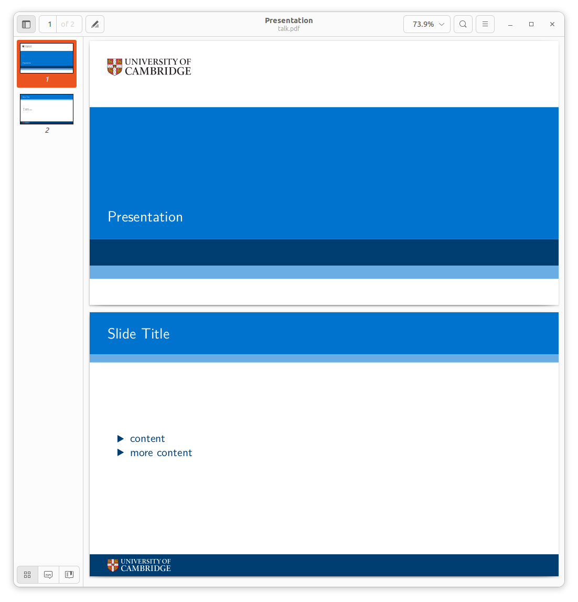

# Quarto Beamer example with University of Cambridge Style

## Example

```markdown
---
title: "Presentation"
format: 
  beamer: 
    aspectratio: 169
    navigation: horizontal
    theme: cambridge
    colortheme: cambridge
    fonttheme: cambridge
    innertheme: cambridge
    outertheme: cambridge
---

## Slide Title

- content
- more content
```

```shell
$ make
quarto render talk.md --output talk.pdf
pandoc --output talk.tex
  to: beamer
  standalone: true
  pdf-engine: xelatex
  variables:
    graphics: true
    tables: true
  default-image-extension: pdf
  
metadata
  block-headings: true
  title: Presentation
  aspectratio: 169
  navigation: horizontal
  theme: cambridge
  colortheme: cambridge
  fonttheme: cambridge
  innertheme: cambridge
  outertheme: cambridge
  
running xelatex - 1
  This is XeTeX, Version 3.141592653-2.6-0.999993 (TeX Live 2022/dev/Debian) (preloaded format=xelatex)
   restricted \write18 enabled.
  entering extended mode
  
running xelatex - 2
  This is XeTeX, Version 3.141592653-2.6-0.999993 (TeX Live 2022/dev/Debian) (preloaded format=xelatex)
   restricted \write18 enabled.
  entering extended mode
  

Output created: talk.pdf
```




